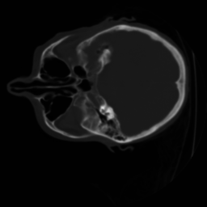
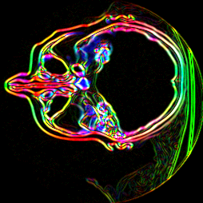

### Scientific Visualization

### Complex volume visualizations.

### Features
1. Human head slicing
2. Human head isosurface rendering
3. Human head contour rendering
4. Heart isosurface rendering

### Visual Techniques

**Interpolation**
- Trilinear
- Cubic
  
**Gradient calculation**

**Rendering**
- Raycasting
- Raymarching
- Gradient Slicing

<table>
  <tr>
    <td> </td>
    <td></td>
   </tr>
    <tr>
    <td></td>
    <td></td>
   <tr>
    <td></td>
    <td></td>
   </tr>
  </tr>
</table>

#### For more Algebraic functions to render like Heart equation, visit [this link](https://homepage.univie.ac.at/herwig.hauser/bildergalerie/gallery.html).
