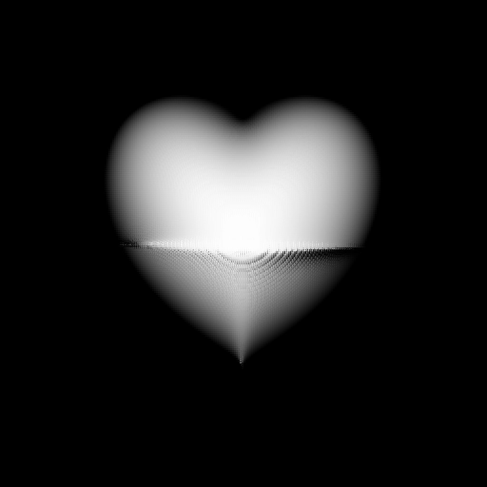

### Heart Equation Isosurface Volume Rendering.

#### Usage
To compile: ```> javac Heart.java ```

To run: ```> java Heart <grid_resolution> <image_resolution> <sampling_distance> ```

example: ```> java Heart 256 512 0.01```

#### Features

- Raycasting (with and without Octree)
    - 3D volume rendering approach with a form of ray marching
- Volumetric Ray Marching
    - 2D slice rendering approach with direct voxel sampling


- Trilinear Interpolation
- Cubic Interpolation
- Variable Resolution, isovalue, sampling distance

```Heart Iso Surface Using Trilinear Interpolation```


```Herat Iso Surface with 2x Zoom on Trilinear Interpolation```


```Heart Iso Surface Using Cubic Interpolation```



**Limitation** - Horizontal visual artifact in the render.
If you can fix this, please create a PR. :)