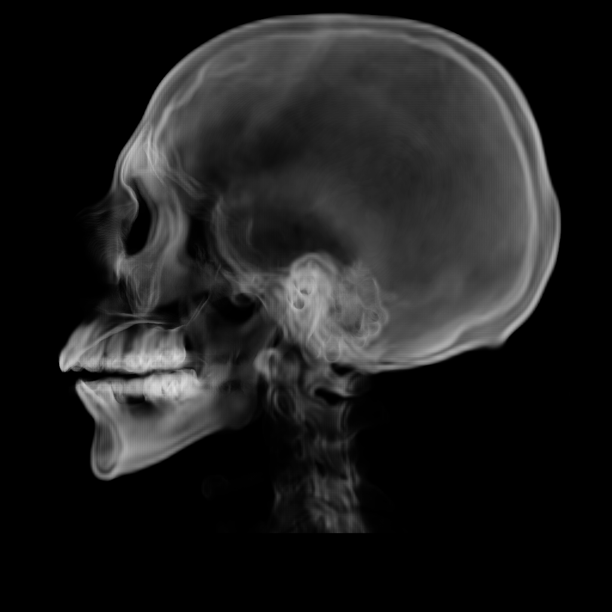

### Human head Isosurface and Contour Volume Rendering

#### Usage
To compile: ```> javac Skull.java ```

To run: ```> java Heart <isovalue> <projection axis> <direction>```

example: ```> java Heart 95 0 false```

direction - true for frontal view, false for back view

#### Features

- Raycasting (with Octree)
    - 3D volume rendering approach with a form of ray marching
- Volumetric Ray Marching
    - 2D slice rendering approach using direct Gradient slices

- Acceleration block
- Trilinear Interpolation
- Variable Resolution, isovalue

**Limition** Direction does not work with my ray casting function. PR for a fix is encouraged. :)

```Skull Contour Render at isovalue 95.```



``` Skull Isosurface Render at Isovaue 95. ```


``` Skull Isosurface Render at Isovaue 68. ```


``` Skull Isosurface Render at Isovaue 95 using slices of the Gradient. ```


