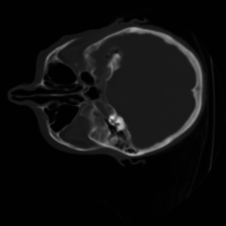
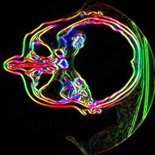
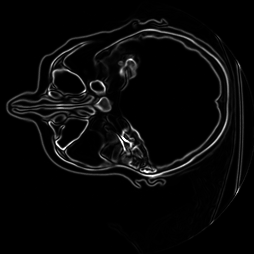

### Human head Slicing

#### Usage

To compile: ```> javac Slice.java ```

To run: ```> java Heart <slice-index>```

example: ```> java Heart 95```

Gradient slices at varying indicies of Human head data.

```Simple Head Slice at index 115```



```Head Slice Gradient at index 115```



```Colored Head Slice Gradient at index 115```


